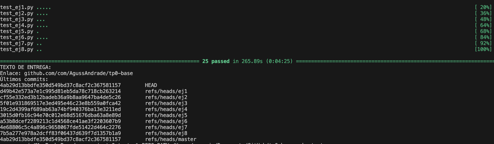
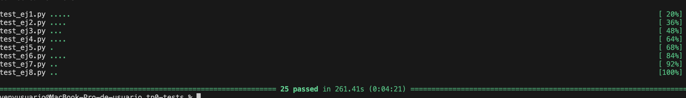

# TP0: Docker + Comunicaciones + Concurrencia

## Agustin Andrade 104046

En el presente repositorio se provee un esqueleto básico de cliente/servidor, en donde todas las dependencias del mismo se encuentran encapsuladas en containers. Los alumnos deberán resolver una guía de ejercicios incrementales, teniendo en cuenta las condiciones de entrega descritas al final de este enunciado.

 El cliente (Golang) y el servidor (Python) fueron desarrollados en diferentes lenguajes simplemente para mostrar cómo dos lenguajes de programación pueden convivir en el mismo proyecto con la ayuda de containers, en este caso utilizando [Docker Compose](https://docs.docker.com/compose/).

## Instrucciones de uso
El repositorio cuenta con un **Makefile** que incluye distintos comandos en forma de targets. Los targets se ejecutan mediante la invocación de:  **make \<target\>**. Los target imprescindibles para iniciar y detener el sistema son **docker-compose-up** y **docker-compose-down**, siendo los restantes targets de utilidad para el proceso de depuración.

Los targets disponibles son:

| target  | accion  |
|---|---|
|  `docker-compose-up`  | Inicializa el ambiente de desarrollo. Construye las imágenes del cliente y el servidor, inicializa los recursos a utilizar (volúmenes, redes, etc) e inicia los propios containers. |
| `docker-compose-down`  | Ejecuta `docker-compose stop` para detener los containers asociados al compose y luego  `docker-compose down` para destruir todos los recursos asociados al proyecto que fueron inicializados. Se recomienda ejecutar este comando al finalizar cada ejecución para evitar que el disco de la máquina host se llene de versiones de desarrollo y recursos sin liberar. |
|  `docker-compose-logs` | Permite ver los logs actuales del proyecto. Acompañar con `grep` para lograr ver mensajes de una aplicación específica dentro del compose. |
| `docker-image`  | Construye las imágenes a ser utilizadas tanto en el servidor como en el cliente. Este target es utilizado por **docker-compose-up**, por lo cual se lo puede utilizar para probar nuevos cambios en las imágenes antes de arrancar el proyecto. |
| `build` | Compila la aplicación cliente para ejecución en el _host_ en lugar de en Docker. De este modo la compilación es mucho más veloz, pero requiere contar con todo el entorno de Golang y Python instalados en la máquina _host_. |

## Parte 3: Repaso de Concurrencia
En este ejercicio es importante considerar los mecanismos de sincronización a utilizar para el correcto funcionamiento de la persistencia.

### Ejercicio N°8:

Modificar el servidor para que permita aceptar conexiones y procesar mensajes en paralelo. En caso de que el alumno implemente el servidor en Python utilizando _multithreading_,  deberán tenerse en cuenta las [limitaciones propias del lenguaje](https://wiki.python.org/moin/GlobalInterpreterLock).

#### Solucion

##### Metodo sincronizacion

- Se agrego una pool de threads al hilo principal que ejecutara cada handleo de agencia
- Si un thread pierde su socket entonces se borra de clients
- habran secciones criticas en la modificacion y consulta de `clients` y file de `bets` mediante el uso de `threading.Lock()`

----

##### Modificaciones realizadas en el servidor

- En el loop principal se esparara que termine el pool de threads
- Se agregaron 2 locks para controlar la seccion critica del guardado de `bets` y el diccionario de `clients`
- Se agregaron logs para controlar la espera de pools y si alguno fallo

Para correr el archivo ejecutar desde la raiz del proyecto:

```bash
./generar-compose.sh docker-compose-dev.yaml 5
make docker-compose-up
```

##### Comentarios luego de la exposicion
- Luego de agregar el sleep pasaron las test del ej6 tanto en deliver como test
- La eleccion de threads fue mas por comodidas y tiempo que por otra cosa
- Se agrego el lock en el gracefull_shutdown
- Se cambio el exception a solo hacer break si es IOException
- demostracion de paralelizacion
```
2025-03-27 19:47:32 2025-03-27 22:47:32 DEBUG    action: config | result: success | port: 12345 | listen_backlog: 5 | logging_level: DEBUG
2025-03-27 19:47:32 2025-03-27 22:47:32 INFO     action: accept_connections | result: in_progress
2025-03-27 19:47:32 2025-03-27 22:47:32 INFO     action: accept_connections | result: success | ip: 172.25.125.3
2025-03-27 19:47:32 2025-03-27 22:47:32 INFO     action: start_thread | result: success | thread_id: 281473838215648
2025-03-27 19:47:32 2025-03-27 22:47:32 INFO     action: accept_connections | result: in_progress
2025-03-27 19:47:32 2025-03-27 22:47:32 INFO     action: accept_connections | result: success | ip: 172.25.125.4
2025-03-27 19:47:32 2025-03-27 22:47:32 INFO     action: start_thread | result: success | thread_id: 281473829822944
2025-03-27 19:47:32 2025-03-27 22:47:32 INFO     action: accept_connections | result: in_progress
2025-03-27 19:47:32 2025-03-27 22:47:32 INFO     action: apuesta_recibida | result: success | cantidad: 10
2025-03-27 19:47:32 2025-03-27 22:47:32 INFO     action: apuesta_recibida | result: success | cantidad: 10
2025-03-27 19:47:32 2025-03-27 22:47:32 INFO     action: accept_connections | result: success | ip: 172.25.125.6
2025-03-27 19:47:32 2025-03-27 22:47:32 INFO     action: start_thread | result: success | thread_id: 281473821430240
2025-03-27 19:47:32 2025-03-27 22:47:32 INFO     action: accept_connections | result: in_progress
2025-03-27 19:47:32 2025-03-27 22:47:32 INFO     action: apuesta_recibida | result: success | cantidad: 10
2025-03-27 19:47:32 2025-03-27 22:47:32 INFO     action: accept_connections | result: success | ip: 172.25.125.7
2025-03-27 19:47:32 2025-03-27 22:47:32 INFO     action: start_thread | result: success | thread_id: 281473813037536
2025-03-27 19:47:32 2025-03-27 22:47:32 INFO     action: accept_connections | result: in_progress
2025-03-27 19:47:32 2025-03-27 22:47:32 INFO     action: accept_connections | result: success | ip: 172.25.125.5
2025-03-27 19:47:32 2025-03-27 22:47:32 INFO     action: start_thread | result: success | thread_id: 281473804644832
2025-03-27 19:47:32 2025-03-27 22:47:32 INFO     action: waiting_for_clients | result: in_progress
2025-03-27 19:47:32 2025-03-27 22:47:32 INFO     action: apuesta_recibida | result: success | cantidad: 10
2025-03-27 19:47:32 2025-03-27 22:47:32 INFO     action: apuesta_recibida | result: success | cantidad: 10
2025-03-27 19:47:32 2025-03-27 22:47:32 INFO     action: apuesta_recibida | result: success | cantidad: 10
2025-03-27 19:47:32 2025-03-27 22:47:32 INFO     action: apuesta_recibida | result: success | cantidad: 10
2025-03-27 19:47:32 2025-03-27 22:47:32 INFO     action: apuesta_recibida | result: success | cantidad: 10
2025-03-27 19:47:32 2025-03-27 22:47:32 INFO     action: apuesta_recibida | result: success | cantidad: 10
2025-03-27 19:47:32 2025-03-27 22:47:32 INFO     action: apuesta_recibida | result: success | cantidad: 10
2025-03-27 19:47:32 2025-03-27 22:47:32 INFO     action: apuesta_recibida | result: success | cantidad: 10
2025-03-27 19:47:32 2025-03-27 22:47:32 INFO     action: apuesta_recibida | result: success | cantidad: 10
2025-03-27 19:47:32 2025-03-27 22:47:32 INFO     action: apuesta_recibida | result: success | cantidad: 10
2025-03-27 19:47:32 2025-03-27 22:47:32 INFO     action: apuesta_recibida | result: success | cantidad: 10
2025-03-27 19:47:32 2025-03-27 22:47:32 INFO     action: apuesta_recibida | result: success | cantidad: 10
2025-03-27 19:47:33 2025-03-27 22:47:33 INFO     action: apuesta_recibida | result: success | cantidad: 10
2025-03-27 19:47:33 2025-03-27 22:47:33 INFO     action: apuesta_recibida | result: success | cantidad: 10
2025-03-27 19:47:33 2025-03-27 22:47:33 INFO     action: apuesta_recibida | result: success | cantidad: 10
2025-03-27 19:47:33 2025-03-27 22:47:33 INFO     action: apuesta_recibida | result: success | cantidad: 10
2025-03-27 19:47:33 2025-03-27 22:47:33 INFO     action: apuesta_recibida | result: success | cantidad: 10
2025-03-27 19:47:33 2025-03-27 22:47:33 INFO     action: apuesta_recibida | result: success | cantidad: 10
2025-03-27 19:47:33 2025-03-27 22:47:33 INFO     action: apuesta_recibida | result: success | cantidad: 10
2025-03-27 19:47:33 2025-03-27 22:47:33 INFO     action: apuesta_recibida | result: success | cantidad: 10
2025-03-27 19:47:33 2025-03-27 22:47:33 INFO     action: apuesta_recibida | result: success | cantidad: 10
2025-03-27 19:47:33 2025-03-27 22:47:33 INFO     action: apuesta_recibida | result: success | cantidad: 10
2025-03-27 19:47:33 2025-03-27 22:47:33 INFO     action: apuesta_recibida | result: success | cantidad: 10
2025-03-27 19:47:33 2025-03-27 22:47:33 INFO     action: apuesta_recibida | result: success | cantidad: 10
2025-03-27 19:47:33 2025-03-27 22:47:33 INFO     action: apuesta_recibida | result: success | cantidad: 10
2025-03-27 19:47:33 2025-03-27 22:47:33 INFO     action: apuesta_recibida | result: success | cantidad: 10
2025-03-27 19:47:33 2025-03-27 22:47:33 INFO     action: apuesta_recibida | result: success | cantidad: 10
2025-03-27 19:47:33 2025-03-27 22:47:33 INFO     action: receive_batch | result: success | reason: empty batch
2025-03-27 19:47:33 2025-03-27 22:47:33 INFO     action: receive_batch | result: success | reason: empty batch
2025-03-27 19:47:33 2025-03-27 22:47:33 INFO     action: receive_batch | result: success | reason: empty batch
2025-03-27 19:47:33 2025-03-27 22:47:33 INFO     action: receive_batch | result: success | reason: empty batch
2025-03-27 19:47:33 2025-03-27 22:47:33 INFO     action: receive_batch | result: success | reason: empty batch
2025-03-27 19:47:33 2025-03-27 22:47:33 INFO     action: handle_bets | result: in_progress | connected: 5
2025-03-27 19:47:33 2025-03-27 22:47:33 INFO     action: consulta_ganadores | result: success | cant_ganadores: 5
2025-03-27 19:47:33 2025-03-27 22:47:33 INFO     action: close_client_socket | result: success | agency: 5
2025-03-27 19:47:33 2025-03-27 22:47:33 INFO     action: consulta_ganadores | result: success | cant_ganadores: 3
2025-03-27 19:47:33 2025-03-27 22:47:33 INFO     action: close_client_socket | result: success | agency: 3
2025-03-27 19:47:33 2025-03-27 22:47:33 INFO     action: consulta_ganadores | result: success | cant_ganadores: 2
2025-03-27 19:47:33 2025-03-27 22:47:33 INFO     action: close_client_socket | result: success | agency: 2
2025-03-27 19:47:33 2025-03-27 22:47:33 INFO     action: consulta_ganadores | result: success | cant_ganadores: 1
2025-03-27 19:47:33 2025-03-27 22:47:33 INFO     action: close_client_socket | result: success | agency: 1
2025-03-27 19:47:33 2025-03-27 22:47:33 INFO     action: consulta_ganadores | result: success | cant_ganadores: 4
2025-03-27 19:47:33 2025-03-27 22:47:33 INFO     action: close_client_socket | result: success | agency: 4
2025-03-27 19:47:33 2025-03-27 22:47:33 INFO     action: sorteo | result: success
```



